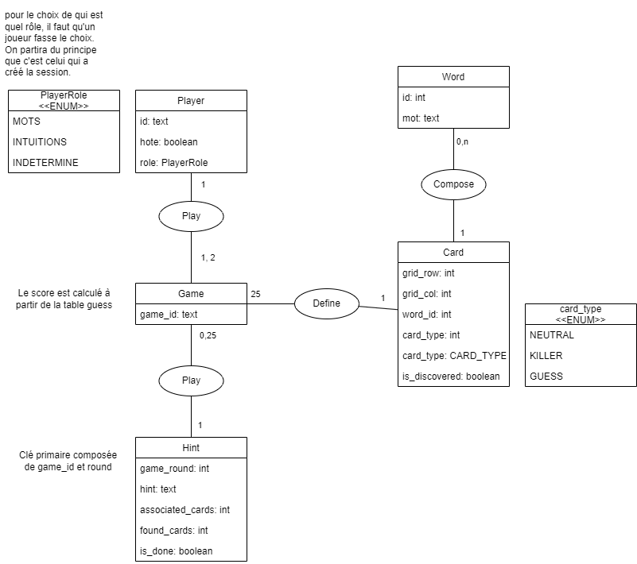

# Polynames

## Avant-propos

Je suis une petite licorne très très spéciale qui ne veut rien faire comme tout le monde. Aussi j'ai utilisé docker pour faire tourner mon instance de xampp. Et vu que je suis sous Fedora, j'ai même pas pris la peine d'installer Docker, j'utilise Podman qui est préinstallé. Enfin, des fois j'utilise Windows du coup c'est avec Docker, bref.


## PREPARATION

Pour lancer sur docker/podman

```
docker compose up
```

Pour pas être embêté du fait de l'origine de la connexion à la base :

```sql
GRANT ALL ON *.* to "root"@"%" IDENTIFIED BY 'password';
```

Maintenant on peut commencer.

## Conception

La lecture du sujet laisse supposé une structure de la base de donnée bien moins complexe qu'elle ne le sera finalement. On distingue bien les entitées, mais le fonctionnement effectif, l'aspect fonctionnel, implique sur le plan technique une surcharge d'information à enregistrer en base de donnée.
Cette surcharge aurait pu facilement être évitée si on avait exploité la notion de session côté serveur. Mais puisque l'on ne l'a pas vu en cours, nous nous en passerons

Voici le diagramme de entités-associations auquel nous avons abouti :



Et son modèle relationnel résultant :


Game (<u>game_code</u>)

Player (<u>cookie</u>, host, player_role, <i>game_code</i>)

Card (<u><i>game_code</i></u>, <u>grid_row</u>, <u>grid_col</u>, <i>word_id</i>, card_type, is_discovered)

Word (<u>id</u>,word)

Hint(<u><i>game_code</i></u>, <u>game_round</u>, hint, associated_cards, found_cards, is_done)

## Considérations de fonctionnalitées pour l'API

### Identification des clients

Les clients sont identifiés par un cookie qui leur est assigné lors de la création de la partie ou lors du moment où ils la rejoignent.

### La websocket

On fera en sorte que chaque partie n'ai qu'une WebSocket active. L'interface devra alors gérer plusieurs types de réponse de l'API. Plusieurs types de réponses sont à prévoir, avec plusieurs types de données présentes :

- `game-start` La partie commence
- `new-hint` Nouvel indice proposé
  - Contient un mot et un nombre
- `new-hint` Nouvelle carte révélée
  - Contient la coordonnée de la carte ainsi que son type (car le client qui devine n'a pas en session les données permettant seul de savoir si il a fini)
  - Le score mis à jour
- Fin de partie (gagnée ou perdu)

En somme, les messages WS permettent aux joueurs de savoir les grands évenements. On imaginera 

### Les routes

#### Créer une partie

`POST /api/new-game` 

La partie est créée quand l'api reçoit une requête de création de partie.
En base de donnée, est enregistré un code identifiant la partie, un sting d'identification de la WebSocket créée, un score à 0 et la grille de solution et la sélection des cartes est directement réalisée pour la partie à venir.

Requête :
pas de corps

Réponse :
`Body`
```json
{
    "game_code": "12b7cb83" // alphanum random sur 8 characters
}
```
Aussi, un cookie : `user-id`

#### Rejoindre une partie

`POST /api/join-game/:game_code` 

#### Proposition d'indice

`POST /api/:game_code/hint` 

Requête :
`Body`
```json
{
    "hint" : "", // pas d'espace, mais pas d'autres vérifications, sinon trop complexe
    "associated_guess" : 1 // range : [1;8]
}
```

Réponse par websocket

#### Tentative de guess

`POST /api/:game_code/guess` 

Requête :
`Body`
```json
{
    "line" : 1, // range : [0;4]
    "column" : 1 // range : [0;4]
}
```

Réponse par websocket

#### Fin de partie

Il faut qu'à la fin de chaque partie, la base de donnée soit vidée de toutes les données relatives à la parties afin de ne pas garder des données inutiles. Ces dernières n'ont d'utilité que pendant la partie.
C'est l'api qui indique aux joueurs que la partie est terminée via un message par la websocket